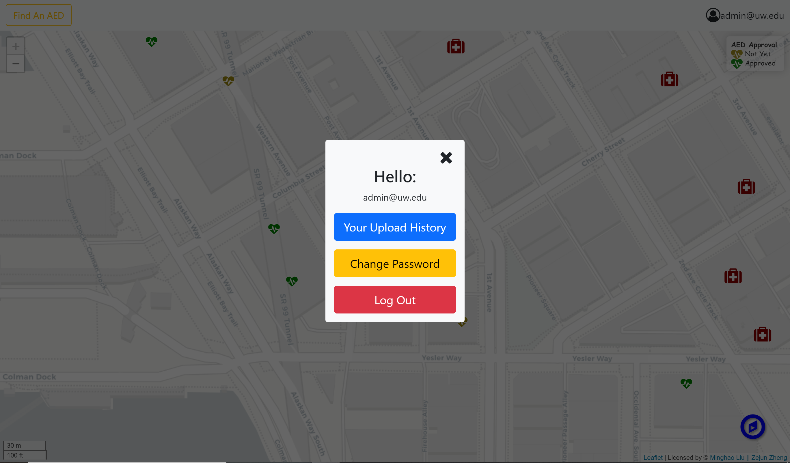
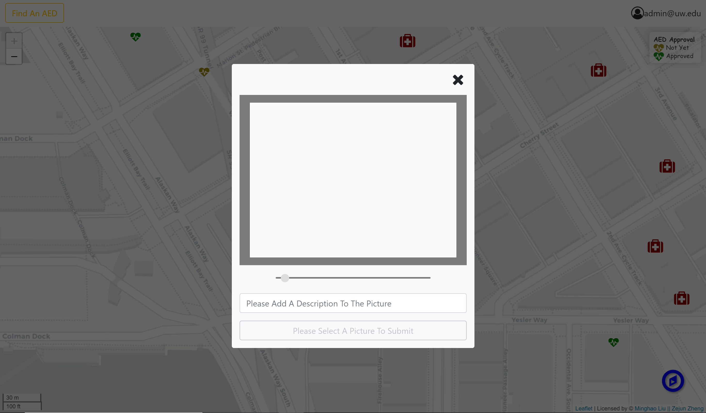
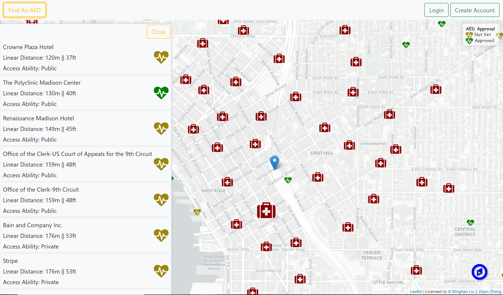
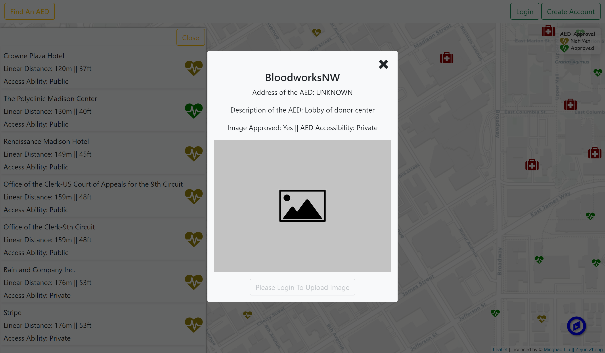

### The web map can be viewed at: https://seattle-aed.lmh98.com/

AED, or automated external defibrillator, is used to help those experiencing sudden cardiac arrest. It's a medical device that can analyze the heart's rhythm and deliver an electrical shock, or defibrillation, to help the heart re-establish an effective rhythm. AED is important because it can restore a normal heart rhythm in victims of sudden cardiac arrest and portable AEDs enable more people to respond to a medical emergency that requires defibrillation. 

The purpose of this project is mainly focused on helping people in need to find the nearest AED in King County. We designed this project as a full stack development, we have a “login” option, “create account” option and “Find an AED '' option. We also have the option that can locate to your current location. More importantly, our product also allows users to upload the picture of the aed location. Other than that, we have an interactive map that is used to analyze the spatial distribution of aed and reflects the density of AEDs in the study area. 

The framework of this project is first we have node js server, which is deployed in the aws elastic beanstalk. And then the database we used is postgresql, it deployed in the aws rds. The font end is deployed in aws amplify. 

When people get into our website, they can visit our website as visitors or as users. If they want to be a user, there is a “Create Account” option in the top right corner. They can create their own account, as shown in figure 1, by input their email address, password and confirm the password. After they finish creating an account, as shown in figure 2, they can sign in with their email address and password. 

_Figure 1: Create Account page_

_Figure 2:  Sign in  page_

Once the users sign in, they can view their account information by clicking on their profile photo. And there are three settings in their account. As shown in figure 3,  First is the user can check his/her upload history, because only the user can upload pictures for specific aed location. Second setting is “Change Password”, it allows the user to change password when they want. The third setting is log out. When the user is done with the website, they can log out their account and sign in again when they need this website. 

_Figure 3:  user account page_

As said before, only users can upload pictures for AED in specific locations. Once the users sign in their account, as shown in figure 4, the system will allow the user to upload AED pictures in specific locations. In figure 5, when a user upload an AED picture, the user can adjust the picture by themselves and add some description about the AED. 

_Figure 4:  pop up window for AED with “upload AED picture” option_

_Figure 5:  adjust picture_

As shown in figure 6, each medical kit represents numbers of aed within the location. The larger the number of aeds within a particular location, the bigger the medical kit. When you click on the medical kit, it will zoom in and identify a more specific location and show the distribution of the AED in this certain area. You can keep zooming in until you find your exact location and identify the location of the aed that is nearest to you. As shown in the map, the legend is “AED approval”, which means each AED is represented by a heart. The map also demonstrates whether the picture of the AED has been approved or not, if the picture of the AED is approved, it displays in green, otherwise, it will be yellow.

There is also a position mark located in the lower right corner, you can locate to your current location immediately once you click on it. And then, you can identify the location of the aed that is nearest to you. 

_Figure 6:  the map page_

After you identify your location, you can click on the ”Find an AED” to find the aed that is nearest to you. It will show a list of aeds location with the name of the aed, the linear distance to your location and access ability. The heart symbol indicates whether the picture of the AED has been approved or not, if the picture of the AED is approved, it displays in green, otherwise, it will be yellow.

_Figure 7:  the map page and “Find An AED” option_

Once you find the location of the AED you want to visit, you can click on that and it will pop up a window, as shown in figure 8, with the name of the location, the specific address of the aed, more description of aed, whether image approved and the AED accessibility. At the bottom of the pop up window, it includes a picture of the location of the AED. However, the visitors(not sign-in) are not allowed to upload AED picture, they have to log-in first and then upload pictures. 

_Figure 8:  pop up window for the AED_

In conclusion, the interactivity of the map allows the users to zoom to specific aeds or geographic regions, which makes it easier to locate each aeds. The user can create an account and log in with their email address and password, once they sign in, they can upload AED pictures in a specific location. Also, the user can identify their current locations and find the nearest AED around them, which will be very convenient to find the location of the AED. 
Having more people in the community who can access to a medical emergency by providing defibrillation will greatly increase sudden cardiac arrest survival rates.
